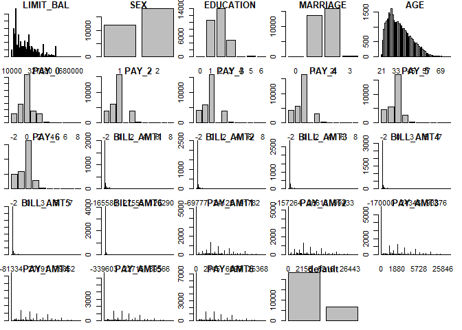

### Summary

In this end-to-end project we are going to create a machine learning predictive model for credit card default probabilities. The project begins with data extraction, data cleaning and data analysis. Afterwards, a blending/stacking ensemble of multiple machine learning algorithms is used.

### Data Source

The data is based on a customers credit card dataset from Taiwan.

### Variable information

This research employed a binary variable, default payment (Yes = 1, No = 0), as the response variable.

X1: Amount of the given credit (NT dollar): it includes both the individual consumer credit and his/her family (supplementary) credit.

X2: Gender (1 = male; 2 = female).

X3: Education (1 = graduate school; 2 = university; 3 = high school; 4 = others).

X4: Marital status (1 = married; 2 = single; 3 = others).

X5: Age (year).

X6 - X11: History of past payment. We tracked the past monthly payment records (from April to September, 2005) as follows: X6 = the repayment status in September, 2005; X7 = the repayment status in August, 2005; . . .;X11 = the repayment status in April, 2005. The measurement scale for the repayment status is: -1 = pay duly; 1 = payment delay for one month; 2 = payment delay for two months; . . .; 8 = payment delay for eight months; 9 = payment delay for nine months and above.

X12-X17: Amount of bill statement (NT dollar). X12 = amount of bill statement in September, 2005; X13 = amount of bill statement in August, 2005; . . .; X17 = amount of bill statement in April, 2005.

X18-X23: Amount of previous payment (NT dollar). X18 = amount paid in September, 2005; X19 = amount paid in August, 2005; . . .;X23 = amount paid in April, 2005.

### Data extraction

First of all, we set the working directory.

``` r
setwd("C:/Users/Daniel Del Castillo/Google Drive/Programacion/Projects/R/Online Retailer/")
```

Download the online retail dataset.

``` r
url <- "https://archive.ics.uci.edu/ml/machine-learning-databases/00350/default of credit card clients.xls"
destfile <- "default of credit card clients.xls"
#download.file(url, destfile, mode="wb")
```

Next we read the first sheet from the downloaded xlsx file with readxl.

``` r
library(readxl)
default_credit <- read_excel(paste(getwd(),
                                       "/",
                                       destfile, 
                                       sep=""), 
                                 sheet = 1, 
                                 col_names = TRUE, 
                                 col_types = NULL, 
                                 na = "", 
                                 skip = 1)
```

### Data analysis

It is always a good idea making a copy of the original dataset, as we might need to check it back later.

``` r
dataset <- default_credit
```

`skimr` package will show us a detailed view of the features in the dataset.

``` r
library(skimr)
skim_with(numeric = list(hist = NULL)) #hiddes histograms
skim(dataset)
```

    ## Skim summary statistics
    ##  n obs: 30000 
    ##  n variables: 25 
    ## 
    ## -- Variable type:numeric --------------------------------------------------------------------------------------------------------------------------------------
    ##                    variable missing complete     n       mean        sd
    ##                         AGE       0    30000 30000     35.49       9.22
    ##                   BILL_AMT1       0    30000 30000  51223.33   73635.86
    ##                   BILL_AMT2       0    30000 30000  49179.08   71173.77
    ##                   BILL_AMT3       0    30000 30000  47013.15   69349.39
    ##                   BILL_AMT4       0    30000 30000  43262.95   64332.86
    ##                   BILL_AMT5       0    30000 30000  40311.4    60797.16
    ##                   BILL_AMT6       0    30000 30000  38871.76   59554.11
    ##  default payment next month       0    30000 30000      0.22       0.42
    ##                   EDUCATION       0    30000 30000      1.85       0.79
    ##                          ID       0    30000 30000  15000.5     8660.4 
    ##                   LIMIT_BAL       0    30000 30000 167484.32  129747.66
    ##                    MARRIAGE       0    30000 30000      1.55       0.52
    ##                       PAY_0       0    30000 30000     -0.017      1.12
    ##                       PAY_2       0    30000 30000     -0.13       1.2 
    ##                       PAY_3       0    30000 30000     -0.17       1.2 
    ##                       PAY_4       0    30000 30000     -0.22       1.17
    ##                       PAY_5       0    30000 30000     -0.27       1.13
    ##                       PAY_6       0    30000 30000     -0.29       1.15
    ##                    PAY_AMT1       0    30000 30000   5663.58   16563.28
    ##                    PAY_AMT2       0    30000 30000   5921.16   23040.87
    ##                    PAY_AMT3       0    30000 30000   5225.68   17606.96
    ##                    PAY_AMT4       0    30000 30000   4826.08   15666.16
    ##                    PAY_AMT5       0    30000 30000   4799.39   15278.31
    ##                    PAY_AMT6       0    30000 30000   5215.5    17777.47
    ##                         SEX       0    30000 30000      1.6        0.49
    ##       p0      p25      p50       p75    p100
    ##       21    28        34       41         79
    ##  -165580  3558.75  22381.5  67091     964511
    ##   -69777  2984.75  21200    64006.25  983931
    ##  -157264  2666.25  20088.5  60164.75 1664089
    ##  -170000  2326.75  19052    54506     891586
    ##   -81334  1763     18104.5  50190.5   927171
    ##  -339603  1256     17071    49198.25  961664
    ##        0     0         0        0          1
    ##        0     1         2        2          6
    ##        1  7500.75  15000.5  22500.25   30000
    ##    10000 50000    140000   240000      1e+06
    ##        0     1         2        2          3
    ##       -2    -1         0        0          8
    ##       -2    -1         0        0          8
    ##       -2    -1         0        0          8
    ##       -2    -1         0        0          8
    ##       -2    -1         0        0          8
    ##       -2    -1         0        0          8
    ##        0  1000      2100     5006     873552
    ##        0   833      2009     5000    1684259
    ##        0   390      1800     4505      9e+05
    ##        0   296      1500     4013.25  621000
    ##        0   252.5    1500     4031.5   426529
    ##        0   117.75   1500     4000     528666
    ##        1     1         2        2          2

We can see some inconsistencies between the data dictionary and the values in the dataset.

There are education values above 4 and also equal 0. We will assume there are other levels.

Pay\_ values go below -1. We will assume -2 as a similar situation to -1.

As this is a mainly predictive project, the inclusion of unknown levels of variable is of less importance. But there should always be a review of those cases with the relevant business unit.

`skimr` summary shows that there are not missing values.

Lets transform the response variable and drop ID

``` r
names(dataset)[names(dataset) == "default payment next month"] <- "default"
dataset[dataset$default==1,"default"] <- "YYY"
dataset[dataset$default==0,"default"] <- "NNN"

dataset$ID <- NULL
```

Next we will create the training (70%) and validation (30%) dataset by a stratified random sampling. A random seed is set for the reproducibility of the whole project.

``` r
seed = 7
library(caret)
```

    ## Loading required package: lattice

    ## Loading required package: ggplot2

``` r
set.seed(seed)
validation_index <- createDataPartition(dataset$default, 
                                        p=0.7, 
                                        list=FALSE)
test <- dataset[-c(validation_index),]
train <- dataset[validation_index,]
```

### Data analysis

Lets take a look at the distribution of the values of the different variables.

``` r
par(mfrow=c(5,5), mar=c(1,1,1,1))
for(i in 1:ncol(dataset)) {
  barplot(table(dataset[,i]), main=names(dataset)[i])
}
```



It is interesting the class imbalance from the response variable (default). Does not seem to be too extreme, so it might not be a big problem for the algorithms.

It would be interesting to check the correlations between numeric variables. `corrplot` package is great for that.

``` r
nums <- sapply(train, is.numeric)
par(mfrow=c(1,1), mar=c(1,1,1,1))
library(corrplot)
```

    ## corrplot 0.84 loaded

``` r
corrplot.mixed(cor(train[,nums]), lower="circle", upper="color", tl.pos="lt", diag="n", order="hclust", hclust.method="complete")
```

 Sex and marriage even when there are represented with a number, are categorical variables.

We can see strong correlation between PAY\_ variables, what is obvious as the payments follow a cumulative trend.

### Data transformation

Lets reduce data dimesionality by transforming Pay\_, BILL\_AMT and PAY\_AMT into their mean an skewness.

``` r
library(e1071) 
train$mean_PAY <- apply(train[,6:11], 1, mean)
train$skw_PAY <- apply(train[,6:11], 1, skewness)

train$mean_BILL_AMT <- apply(train[,12:17], 1, mean)
train$skw_BILL_AMT <- apply(train[,12:17], 1, skewness)

train$mean_PAY_AMT <- apply(train[,18:23], 1, mean)
train$skw_PAY_AMT <- apply(train[,18:23], 1, skewness)

train[is.na(train)] <- 0

train <- train[,-c(6:23)]
```

### Modelling

We are going to follow a blending approach that trains different models in different subsets of data, this is usually done in big dataset or in limited hardware environments. That means that the subset should be random, so lets randomize the dataset first.

``` r
train <- train[sample(nrow(train)),]
```

We are going to use the excellent `caret` package, as it makes easier switching between algorithms and training them by cross-validation. We are going to set the training controls such that the models are trained in k 7 fold cross-validation, repeated 2 times, by using the logarithmic loss as test metric. Different models are going to be trained in different samples from the dataset.

``` r
control <- trainControl(
  method="repeatedcv",
  number=7,
  repeats=2,
  verboseIter=FALSE,
  classProbs=TRUE,
  summaryFunction = mnLogLoss
)
metric<-"logLoss"
```

#### Linear models

Partial least squares

``` r
lb<-1
ub<-round((nrow(train)*2/7))
set.seed(seed)
fit.pls <- train(default~., data=train[lb:ub,], method="pls", metric=metric, preProc=c("center", "scale"), trControl=control)
```

Elastic net Generalized Linear Model

``` r
lb<-round((nrow(train)*2/7))
ub<-round((nrow(train)*3/7))
set.seed(seed)
fit.glmnet <- train(default~., data=train[lb:ub,], method="glmnet", metric=metric, preProc=c("center", "scale"), trControl=control)
```

#### Non-Linear models

Support Vector Machines with Radial Kernel

``` r
lb<-round((nrow(train)*3/7))
ub<-round((nrow(train)*4/7))
set.seed(seed)
fit.svmRadial <- train(default~., data=train[lb:ub,], method="svmRadial", metric=metric, preProc=c("center", "scale"), trControl=control)
```

K nearest neighbors

``` r
lb<-round((nrow(train)*4/7))
ub<-round((nrow(train)*5/7))
set.seed(seed)
fit.knn <- train(default~., data=train[lb:ub,], method="knn", metric=metric, preProc=c("center", "scale"), trControl=control)
```

Random Forest

``` r
lb<-round((nrow(train)*5/7))
ub<-round((nrow(train)*6/7))
set.seed(seed)
fit.rf <- train(default~., data=train[lb:ub,], method="rf", metric=metric, trControl=control)
```

Extreme Gradient Boosting Trees

``` r
lb<-round((nrow(train)*6/7))
ub<-nrow(train)
set.seed(seed)
fit.xgbTree <- train(default~., data=train[lb:ub,], method="xgbTree", metric=metric, trControl=control)
```

Compare algorithms

``` r
results <- resamples(list(
  pls=fit.pls,
  glmnet=fit.glmnet,
  svmRadial=fit.svmRadial,
  knn=fit.knn,
  rf=fit.rf,
  xgbTree=fit.xgbTree
))
summary(results)
```

    ## 
    ## Call:
    ## summary.resamples(object = results)
    ## 
    ## Models: pls, glmnet, svmRadial, knn, rf, xgbTree 
    ## Number of resamples: 14 
    ## 
    ## logLoss 
    ##                Min.   1st Qu.    Median      Mean   3rd Qu.      Max. NA's
    ## pls       0.5482332 0.5510435 0.5531578 0.5532998 0.5556508 0.5574906    0
    ## glmnet    0.4709106 0.4752451 0.4843782 0.4865221 0.4919985 0.5202401    0
    ## svmRadial 0.4357344 0.4569580 0.4636545 0.4627700 0.4715853 0.4885434    0
    ## knn       0.9765093 1.0800499 1.2804626 1.3206749 1.5092730 1.8489673    0
    ## rf        0.4232815 0.4412827 0.4609792 0.4620061 0.4818078 0.4952000    0
    ## xgbTree   0.4181194 0.4276332 0.4353483 0.4354262 0.4420360 0.4515846    0

``` r
parallelplot(results)
```


We can se that the tree based methods and support vector machines are superior.

Model correlation matrix and airwise scatter plots of predictions to compare models

``` r
modelCor(results)
```

    ##                   pls      glmnet   svmRadial          knn           rf
    ## pls        1.00000000  0.11574713  0.44286316 -0.178872621  0.144053931
    ## glmnet     0.11574713  1.00000000  0.08572413 -0.146338190 -0.094411125
    ## svmRadial  0.44286316  0.08572413  1.00000000 -0.247760406  0.227791721
    ## knn       -0.17887262 -0.14633819 -0.24776041  1.000000000  0.006488677
    ## rf         0.14405393 -0.09441112  0.22779172  0.006488677  1.000000000
    ## xgbTree    0.06411662  0.04698284 -0.14000008  0.239582634 -0.235894817
    ##               xgbTree
    ## pls        0.06411662
    ## glmnet     0.04698284
    ## svmRadial -0.14000008
    ## knn        0.23958263
    ## rf        -0.23589482
    ## xgbTree    1.00000000

``` r
splom(results)
```


There are not signs of strong correlation between model predictions, therefore, ensembling their predictions should improve accuracy.

Dot-plot of predictions to compare models

``` r
dotplot(results)
```


### Ensembling

The current ensembling approach is going to be a multiple superlearner voting approach. We are going to train 3 different models on the sub-models predictions and calculate the mode between their new predictions. There is a limited effect of overfitraining the models in the same samples as the sub-models were training in a small subset of the training dataset.

So lets first make predictions with the sub-models in the whole training set.

Create sub-models predictions dataset

``` r
train_stack <- data.frame(cbind(
  default = train[,"default"], 
  pls = unlist(predict(fit.pls, newdata = train, type = "prob")[1]),
  glmnet = unlist(predict(fit.glmnet, newdata = train, type = "prob")[1]),
  svmRadial = unlist(predict(fit.svmRadial, newdata = train, type = "prob")[1]),
  knn = unlist(predict(fit.knn, newdata = train, type = "prob")[1]),
  rf = unlist(predict(fit.rf, newdata = train, type = "prob")[1]),
  xgbTree = unlist(predict(fit.xgbTree, newdata = train, type = "prob")[1])
))
```

#### stacking models

Now we train the superlearners.

Stack with extreme gradient boosting trees

``` r
set.seed(seed)
fit.xgbTree_stack <- train(default~., data=train_stack, method="xgbTree", metric=metric, trControl=control)
```

Stack with random forests

``` r
set.seed(seed)
fit.rf_stack <- train(default~., data=train_stack, method="rf", metric=metric, trControl=control)

```

Stack with multivariate adaptive regression splines (MARS)

``` r
set.seed(seed)
fit.earth_stack <- train(default~., data=train_stack, method="earth", metric=metric, trControl=control)
```

We have now our level 1 and 2 models trained. Lets make predictions now on the out-of-sample dataset for validating the model.

### Validation

First we need to follow the same data cleaning and transformation process in the testing dataset.

``` r
test <- test[test$EDUCATION>0,]
test$AGE <- cut(test$AGE, breaks=seq(10, 100, 10), labels = FALSE)
test$mean_PAY <- apply(test[,6:11], 1, mean)
test$skw_PAY <- apply(test[,6:11], 1, skewness)
test$mean_BILL_AMT <- apply(test[,12:17], 1, mean)
test$skw_BILL_AMT <- apply(test[,12:17], 1, skewness)
test$mean_PAY_AMT <- apply(test[,18:23], 1, mean)
test$skw_PAY_AMT <- apply(test[,18:23], 1, skewness)
test <- test[,-c(6:23)]
test[is.na(test)] <- 0
```

Make predictions with the sub-models

``` r
set.seed(seed)
test_stack <- data.frame(cbind(
  default = test[,"default"], 
  pls = unlist(predict(fit.pls, newdata = test, type = "prob")[1]),
  glmnet = unlist(predict(fit.glmnet, newdata = test, type = "prob")[1]),
  svmRadial = unlist(predict(fit.svmRadial, newdata = test, type = "prob")[1]),
  knn = unlist(predict(fit.knn, newdata = test, type = "prob")[1]),
  rf = unlist(predict(fit.rf, newdata = test, type = "prob")[1]),
  xgbTree = unlist(predict(fit.xgbTree, newdata = test, type = "prob")[1])
))
```

Define the mode function

``` r
Mode <- function(x) {
  ux <- unique(x)
  ux[which.max(tabulate(match(x, ux)))]
}
```

Finally we make predictions with the superlearners and vote for the binary classes.

``` r
mat2 <- data.frame(matrix(nrow=nrow(test_stack),ncol=3))

mat2[,1] <- predict(fit.xgbTree_stack, newdata = test_stack,type = "raw")
mat2[,2] <- predict(fit.rf_stack, newdata = test_stack,type = "raw")
mat2[,3] <- predict(fit.earth_stack, newdata = test_stack,type = "raw")

test_predicted <- apply(mat2, 1, Mode)
```

Next we evaluate the model accuracy.

``` r
# Check confusion matrix
print(confusionMatrix(as.factor(test_predicted), as.factor(test_stack[,1]), positive = "YYY"))
```

    ## Confusion Matrix and Statistics
    ## 
    ##           Reference
    ## Prediction  NNN  YYY
    ##        NNN 6614 1397
    ##        YYY  392  593
    ##                                           
    ##                Accuracy : 0.8011          
    ##                  95% CI : (0.7927, 0.8093)
    ##     No Information Rate : 0.7788          
    ##     P-Value [Acc > NIR] : 1.268e-07       
    ##                                           
    ##                   Kappa : 0.2955          
    ##  Mcnemar's Test P-Value : < 2.2e-16       
    ##                                           
    ##             Sensitivity : 0.29799         
    ##             Specificity : 0.94405         
    ##          Pos Pred Value : 0.60203         
    ##          Neg Pred Value : 0.82561         
    ##              Prevalence : 0.22121         
    ##          Detection Rate : 0.06592         
    ##    Detection Prevalence : 0.10949         
    ##       Balanced Accuracy : 0.62102         
    ##                                           
    ##        'Positive' Class : YYY             
    ## 

An accuracy of over 80% has been achieved in out of sample testing. We can see that the models predictions are better than a random guessing and therefore the model it's doing its job!

### References

Yeh, I. C., & Lien, C. H. (2009). The comparisons of data mining techniques for the predictive accuracy of probability of default of credit card clients. Expert Systems with Applications, 36(2), 2473-2480.
