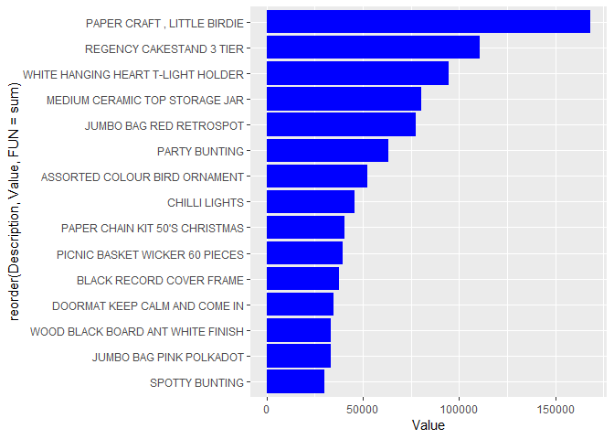
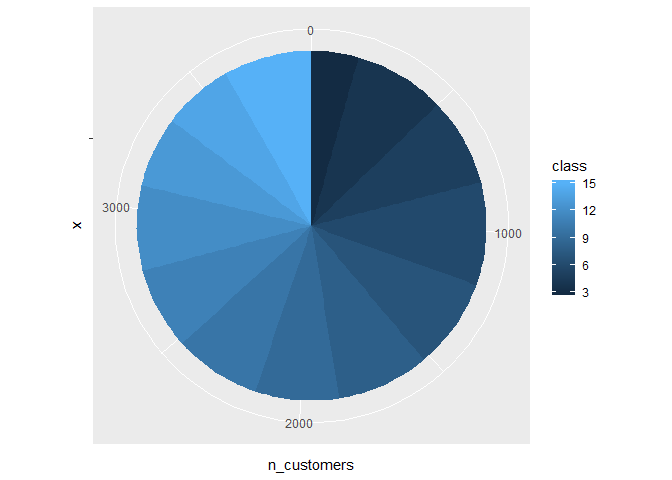

### Summary

In this end-to-end project we are going to find the group of customers that provide more value to the company and that we would target in a loyalty campaign. The approach used will be the RFM model. This model clusters customers based on their Recency, Frequency and Monetary values.

### Data Source

This is a transnational data set which contains all the transactions occurring between 01/12/2010 and 09/12/2011 for a UK-based and registered non-store online retail.The company mainly sells unique all-occasion gifts. Many customers of the company are wholesalers.

### Variable information

InvoiceNo: Invoice number. Nominal, a 6-digit integral number uniquely assigned to each transaction. If this code starts with letter 'c', it indicates a cancellation.

StockCode: Product (item) code. Nominal, a 5-digit integral number uniquely assigned to each distinct product.

Description: Product (item) name. Nominal.

Quantity: The quantities of each product (item) per transaction. Numeric.

InvoiceDate: Invoice Date and time. Numeric, the day and time when each transaction was generated.

UnitPrice: Unit price. Numeric, Product price per unit in sterling.

CustomerID: Customer number. Nominal, a 5-digit integral number uniquely assigned to each customer.

Country: Country name. Nominal, the name of the country where each customer resides.

### Data extraction

First of all, we set the working directory.

``` r
setwd("C:/Users/Daniel Del Castillo/Google Drive/Programacion/Projects/R/Online Retailer/")
```

Download the online retail dataset.

``` r
url <- "https://archive.ics.uci.edu/ml/machine-learning-databases/00352/Online Retail.xlsx"
destfile <- "Online Retail.xlsx"
#download.file(url, destfile, mode="wb")
```

Next we read the first sheet from the downloaded xlsx file with readxl.

``` r
library(readxl)
online_retail_data <- read_excel(paste(getwd(),
                                       "/",
                                       destfile, 
                                       sep=""), 
                                 sheet = 1, 
                                 col_names = TRUE, 
                                 col_types = NULL, 
                                 na = "", 
                                 skip = 0)
```

### Data analysis

It is always a good idea making a copy of the original dataset, as we might need to check it back later.

``` r
or_data <- online_retail_data
```

We should check if the dataset is consistent from the beginning to the end and have a first look at it.

``` r
head(or_data)
```

    ## # A tibble: 6 x 8
    ##   InvoiceNo StockCode Description Quantity InvoiceDate         UnitPrice
    ##   <chr>     <chr>     <chr>          <dbl> <dttm>                  <dbl>
    ## 1 536365    85123A    WHITE HANG~        6 2010-12-01 08:26:00      2.55
    ## 2 536365    71053     WHITE META~        6 2010-12-01 08:26:00      3.39
    ## 3 536365    84406B    CREAM CUPI~        8 2010-12-01 08:26:00      2.75
    ## 4 536365    84029G    KNITTED UN~        6 2010-12-01 08:26:00      3.39
    ## 5 536365    84029E    RED WOOLLY~        6 2010-12-01 08:26:00      3.39
    ## 6 536365    22752     SET 7 BABU~        2 2010-12-01 08:26:00      7.65
    ## # ... with 2 more variables: CustomerID <dbl>, Country <chr>

``` r
tail(or_data)
```

    ## # A tibble: 6 x 8
    ##   InvoiceNo StockCode Description Quantity InvoiceDate         UnitPrice
    ##   <chr>     <chr>     <chr>          <dbl> <dttm>                  <dbl>
    ## 1 581587    23256     CHILDRENS ~        4 2011-12-09 12:50:00      4.15
    ## 2 581587    22613     PACK OF 20~       12 2011-12-09 12:50:00      0.85
    ## 3 581587    22899     CHILDREN'S~        6 2011-12-09 12:50:00      2.1 
    ## 4 581587    23254     CHILDRENS ~        4 2011-12-09 12:50:00      4.15
    ## 5 581587    23255     CHILDRENS ~        4 2011-12-09 12:50:00      4.15
    ## 6 581587    22138     BAKING SET~        3 2011-12-09 12:50:00      4.95
    ## # ... with 2 more variables: CustomerID <dbl>, Country <chr>

StockCode variable values do not seem to match the variable description as there are not only 5-digit integral numbers, but additional letters after. `skimr` package will show us a more detailed view of the features in the dataset.

``` r
library(skimr)
skim_with(numeric = list(hist = NULL)) #hiddes histograms
skim(or_data)
```

    ## Skim summary statistics
    ##  n obs: 541909 
    ##  n variables: 8 
    ## 
    ## -- Variable type:character ------------------------------------------------------------------------------------------------------------------------------------
    ##     variable missing complete      n min max empty n_unique
    ##      Country       0   541909 541909   3  20     0       38
    ##  Description    1454   540455 541909   1  35     0     4211
    ##    InvoiceNo       0   541909 541909   6   7     0    25900
    ##    StockCode       0   541909 541909   1  12     0     4070
    ## 
    ## -- Variable type:numeric --------------------------------------------------------------------------------------------------------------------------------------
    ##    variable missing complete      n     mean      sd        p0      p25
    ##  CustomerID  135080   406829 541909 15287.69 1713.6   12346    13953   
    ##    Quantity       0   541909 541909     9.55  218.08 -80995        1   
    ##   UnitPrice       0   541909 541909     4.61   96.76 -11062.06     1.25
    ##       p50      p75  p100
    ##  15152    16791    18287
    ##      3       10    80995
    ##      2.08     4.13 38970
    ## 
    ## -- Variable type:POSIXct --------------------------------------------------------------------------------------------------------------------------------------
    ##     variable missing complete      n        min        max     median
    ##  InvoiceDate       0   541909 541909 2010-12-01 2011-12-09 2011-07-19
    ##  n_unique
    ##     23260

There are some missing descriptions, a small amount of the total dataset, so it should be safe to exclude it for the current analysis. A more careful approach should be taken with the CustomerID, as there are 135080 missing values. As the current analysis aims to segment the customers, we need to exclude those records. In a real life scenario, the reason of that should be carefully addressed, as it could dramatically bias the analysis.

Negative values can be seen for Quantity and UnitPrice, what probably refers to returns.

According to the data dictionary, the InvoiceNo that begin with "c" refer to cancellations. Lets check how many cases are like that () transforming the variable to lower case prior to the subsetting should prevent problems with upper/lower cases).

``` r
sum(substr(tolower(or_data$InvoiceNo),1,1)=="c")
```

    ## [1] 9288

The current analysis shouldn't be highly affected by the exclusion of those. Lets also exclude all the other special cases in order to have a clean dataset.

``` r
or_data <- or_data[!substr(tolower(or_data$InvoiceNo),1,1)=="C",]
or_data <- or_data[or_data$Quantity>0,]
or_data <- or_data[or_data$UnitPrice>0,]
or_data <- or_data[!is.na(or_data$CustomerID),]
or_data <- or_data[!is.na(or_data$Description),]
```

The number of 23260 unique date cases in a bit more than a year, looks like there are multiple purchases in different times of each day, lets round that, as we are not interested in what happens across the day. `lubridate` package makes working with dates an easier task.

``` r
library(lubridate)
or_data$InvoiceDate <- round_date(or_data$InvoiceDate, unit="day")
```

Lets look again to our improved dataset.

``` r
skim(or_data)
```

    ## Skim summary statistics
    ##  n obs: 397884 
    ##  n variables: 8 
    ## 
    ## -- Variable type:character ------------------------------------------------------------------------------------------------------------------------------------
    ##     variable missing complete      n min max empty n_unique
    ##      Country       0   397884 397884   3  20     0       37
    ##  Description       0   397884 397884   6  35     0     3866
    ##    InvoiceNo       0   397884 397884   6   6     0    18532
    ##    StockCode       0   397884 397884   1  12     0     3665
    ## 
    ## -- Variable type:numeric --------------------------------------------------------------------------------------------------------------------------------------
    ##    variable missing complete      n     mean      sd        p0      p25
    ##  CustomerID       0   397884 397884 15294.42 1713.14 12346     13969   
    ##    Quantity       0   397884 397884    12.99  179.33     1         2   
    ##   UnitPrice       0   397884 397884     3.12   22.1      0.001     1.25
    ##       p50      p75     p100
    ##  15159    16795    18287   
    ##      6       12    80995   
    ##      1.95     3.75  8142.75
    ## 
    ## -- Variable type:POSIXct --------------------------------------------------------------------------------------------------------------------------------------
    ##     variable missing complete      n        min        max     median
    ##  InvoiceDate       0   397884 397884 2010-12-01 2011-12-10 2011-08-01
    ##  n_unique
    ##       361

There are still some figures that look strange, for example, that the largest purchase was of 80995 items (of the same kind).

``` r
head(or_data[order(or_data$Quantity, decreasing = TRUE),], n = 20)
```

    ## # A tibble: 20 x 8
    ##    InvoiceNo StockCode Description Quantity InvoiceDate         UnitPrice
    ##    <chr>     <chr>     <chr>          <dbl> <dttm>                  <dbl>
    ##  1 581483    23843     PAPER CRAF~    80995 2011-12-09 00:00:00      2.08
    ##  2 541431    23166     MEDIUM CER~    74215 2011-01-18 00:00:00      1.04
    ##  3 573008    84077     WORLD WAR ~     4800 2011-10-28 00:00:00      0.21
    ##  4 554868    22197     SMALL POPC~     4300 2011-05-27 00:00:00      0.72
    ##  5 544612    22053     EMPIRE DES~     3906 2011-02-22 00:00:00      0.82
    ##  6 560599    18007     ESSENTIAL ~     3186 2011-07-20 00:00:00      0.06
    ##  7 540815    21108     FAIRY CAKE~     3114 2011-01-12 00:00:00      2.1 
    ##  8 550461    21108     FAIRY CAKE~     3114 2011-04-19 00:00:00      2.1 
    ##  9 573995    16014     SMALL CHIN~     3000 2011-11-02 00:00:00      0.32
    ## 10 536830    84077     WORLD WAR ~     2880 2010-12-03 00:00:00      0.18
    ## 11 562439    84879     ASSORTED C~     2880 2011-08-05 00:00:00      1.45
    ## 12 554272    21977     PACK OF 60~     2700 2011-05-24 00:00:00      0.42
    ## 13 543057    84077     WORLD WAR ~     2592 2011-02-03 00:00:00      0.21
    ## 14 539101    22693     GROW A FLY~     2400 2010-12-16 00:00:00      0.94
    ## 15 543669    22693     GROW A FLY~     2400 2011-02-11 00:00:00      0.94
    ## 16 544152    18007     ESSENTIAL ~     2400 2011-02-17 00:00:00      0.06
    ## 17 573003    23084     RABBIT NIG~     2400 2011-10-28 00:00:00      2.08
    ## 18 547037    21967     PACK OF 12~     2160 2011-03-20 00:00:00      0.25
    ## 19 574294    21915     RED  HARMO~     2100 2011-11-04 00:00:00      1.06
    ## 20 579498    23084     RABBIT NIG~     2040 2011-11-30 00:00:00      1.79
    ## # ... with 2 more variables: CustomerID <dbl>, Country <chr>

Looking at the largest purchases, there are two massive outlier records. Without a deeper knowledge from the company we can not guess if those values are right, therefore we are going to leave them there.

By looking at the largest values from UnitPrice we can see postage and manual inputs.

``` r
head(or_data[order(or_data$UnitPrice, decreasing = TRUE),], n = 20)
```

    ## # A tibble: 20 x 8
    ##    InvoiceNo StockCode Description Quantity InvoiceDate         UnitPrice
    ##    <chr>     <chr>     <chr>          <dbl> <dttm>                  <dbl>
    ##  1 551697    POST      POSTAGE            1 2011-05-04 00:00:00     8143.
    ##  2 573077    M         Manual             1 2011-10-28 00:00:00     4161.
    ##  3 573080    M         Manual             1 2011-10-28 00:00:00     4161.
    ##  4 571751    M         Manual             1 2011-10-19 00:00:00     3949.
    ##  5 569382    M         Manual             1 2011-10-04 00:00:00     3156.
    ##  6 562946    M         Manual             1 2011-08-11 00:00:00     2500 
    ##  7 548813    M         Manual             1 2011-04-05 00:00:00     2383.
    ##  8 571751    M         Manual             1 2011-10-19 00:00:00     2119.
    ##  9 548820    M         Manual             1 2011-04-05 00:00:00     2053.
    ## 10 566927    M         Manual             1 2011-09-16 00:00:00     2033.
    ## 11 549468    M         Manual             1 2011-04-09 00:00:00     1868.
    ## 12 546328    M         Manual             1 2011-03-11 00:00:00     1687.
    ## 13 546329    M         Manual             1 2011-03-11 00:00:00     1687.
    ## 14 580727    DOT       DOTCOM POS~        1 2011-12-06 00:00:00     1599.
    ## 15 579196    DOT       DOTCOM POS~        1 2011-11-29 00:00:00     1527.
    ## 16 576339    DOT       DOTCOM POS~        1 2011-11-15 00:00:00     1500.
    ## 17 578270    DOT       DOTCOM POS~        1 2011-11-24 00:00:00     1270.
    ## 18 548813    M         Manual             1 2011-04-05 00:00:00     1253.
    ## 19 554155    M         Manual             1 2011-05-23 00:00:00     1242.
    ## 20 554301    M         Manual             1 2011-05-24 00:00:00     1242.
    ## # ... with 2 more variables: CustomerID <dbl>, Country <chr>

Postage records should be excluded, as there are not a source of net income for the company.

By looking at the smallest unit prices, some special records appear to.

``` r
head(or_data[order(or_data$UnitPrice, decreasing = FALSE),], n = 20)
```

    ## # A tibble: 20 x 8
    ##    InvoiceNo StockCode Description Quantity InvoiceDate         UnitPrice
    ##    <chr>     <chr>     <chr>          <dbl> <dttm>                  <dbl>
    ##  1 550193    PADS      PADS TO MA~        1 2011-04-15 00:00:00     0.001
    ##  2 561226    PADS      PADS TO MA~        1 2011-07-26 00:00:00     0.001
    ##  3 568200    PADS      PADS TO MA~        1 2011-09-26 00:00:00     0.001
    ##  4 568375    BANK CHA~ Bank Charg~        1 2011-09-27 00:00:00     0.001
    ##  5 555876    16045     POPART WOO~      100 2011-06-08 00:00:00     0.04 
    ##  6 556267    16045     POPART WOO~      500 2011-06-10 00:00:00     0.04 
    ##  7 557006    16045     POPART WOO~      100 2011-06-16 00:00:00     0.04 
    ##  8 557009    16045     POPART WOO~      100 2011-06-16 00:00:00     0.04 
    ##  9 557057    16045     POPART WOO~      100 2011-06-17 00:00:00     0.04 
    ## 10 557492    16045     POPART WOO~      100 2011-06-21 00:00:00     0.04 
    ## 11 557639    16045     POPART WOO~      100 2011-06-22 00:00:00     0.04 
    ## 12 558389    16045     POPART WOO~      100 2011-06-29 00:00:00     0.04 
    ## 13 559358    16045     POPART WOO~      100 2011-07-08 00:00:00     0.04 
    ## 14 559513    16045     POPART WOO~      100 2011-07-09 00:00:00     0.04 
    ## 15 559979    16045     POPART WOO~      100 2011-07-14 00:00:00     0.04 
    ## 16 560106    16045     POPART WOO~      100 2011-07-15 00:00:00     0.04 
    ## 17 560259    16045     POPART WOO~      100 2011-07-18 00:00:00     0.04 
    ## 18 560300    16045     POPART WOO~      100 2011-07-18 00:00:00     0.04 
    ## 19 560504    16045     POPART WOO~      100 2011-07-19 00:00:00     0.04 
    ## 20 560828    16045     POPART WOO~      100 2011-07-21 00:00:00     0.04 
    ## # ... with 2 more variables: CustomerID <dbl>, Country <chr>

Values below 1p should be excluded.

As we have seen, many StockCode records do not follow the data dictionary rules.

``` r
head(unique(or_data[is.na(as.numeric(or_data$StockCode)),]$StockCode), n = 20)
```

    ##  [1] "85123A"  "84406B"  "84029G"  "POST"    "82494L"  "85099C"  "84997B" 
    ##  [8] "84997C"  "84519A"  "85183B"  "85071B"  "37444A"  "37444C"  "84971S" 
    ## [15] "15056BL" "15056N"  "85049A"  "85099B"  "35004C"  "35004G"

Values with an appended letter look like variation of the same product. But some of them look like special records.

``` r
or_data$StockCode_mod <- substr(or_data$StockCode, 1, 5)

unique(or_data[is.na(as.numeric(or_data$StockCode_mod)),]$StockCode_mod)
```

    ## [1] "POST"  "C2"    "M"     "BANK " "PADS"  "DOT"

Lets remove all the special cases apart from the manual inputs.

``` r
or_data <- or_data[or_data$StockCode_mod!="POST",]
or_data <- or_data[or_data$StockCode_mod!="C2",]
or_data <- or_data[or_data$StockCode_mod!="BANK ",]
or_data <- or_data[or_data$StockCode_mod!="PADS",]
or_data <- or_data[or_data$StockCode_mod!="DOT",]

or_data$StockCode_mod <- NULL
```

Lets go back again to the dataset summary.

``` r
skim(or_data)
```

    ## Skim summary statistics
    ##  n obs: 396621 
    ##  n variables: 8 
    ## 
    ## -- Variable type:character ------------------------------------------------------------------------------------------------------------------------------------
    ##     variable missing complete      n min max empty n_unique
    ##      Country       0   396621 396621   3  20     0       37
    ##  Description       0   396621 396621   6  35     0     3861
    ##    InvoiceNo       0   396621 396621   6   6     0    18466
    ##    StockCode       0   396621 396621   1   7     0     3660
    ## 
    ## -- Variable type:numeric --------------------------------------------------------------------------------------------------------------------------------------
    ##    variable missing complete      n     mean      sd       p0      p25
    ##  CustomerID       0   396621 396621 15301.76 1710.07 12346    13975   
    ##    Quantity       0   396621 396621    13.02  179.62     1        2   
    ##   UnitPrice       0   396621 396621     2.99   16.85     0.04     1.25
    ##       p50      p75     p100
    ##  15159    16804    18287   
    ##      6       12    80995   
    ##      1.95     3.75  4161.06
    ## 
    ## -- Variable type:POSIXct --------------------------------------------------------------------------------------------------------------------------------------
    ##     variable missing complete      n        min        max     median
    ##  InvoiceDate       0   396621 396621 2010-12-01 2011-12-10 2011-08-01
    ##  n_unique
    ##       361

The values now look consistent and the dataset cleaner.

Lets check the distribution of sales by country.

``` r
library(ggplot2)
ggplot(data=or_data, 
       aes(x=reorder(Country, 
                Quantity, 
                FUN = sum), 
           y=Quantity))+
  geom_bar(stat = "identity", 
           fill="blue") +
    coord_flip()
```


UK looks like the main market for the company. We will take sales only from that country, as mixing customer from different countries or cultures could lead to a biased analysis.

``` r
or_data <- or_data[or_data$Country=="United Kingdom",]
```

We will use now the amazing `dplyr` to take a deeper look into the data. What are the best selling products?

``` r
library(dplyr)
top15_prods_quant <- or_data %>%
                      group_by(Description) %>%
                      summarise(Quantity = sum(Quantity)) %>%
                      top_n(15, Quantity) %>%
                      arrange(desc(Quantity))

ggplot(data=top15_prods_quant, 
  aes(x=reorder(Description, 
                Quantity, 
                FUN = sum), 
      y=Quantity)) +
  geom_bar(stat="identity", fill="blue") + 
  coord_flip()
```


And the ones that generate more income for the company?

``` r
or_data$Value <- or_data$Quantity * or_data$UnitPrice

top15_prods_val <- or_data %>%
                    group_by(Description) %>%
                    summarise(Value = sum(Value)) %>%
                    top_n(15, Value) %>%
                    arrange(desc(Value))

ggplot(data=top15_prods_val, 
  aes(x=reorder(Description, 
                Value, 
                FUN = sum), 
     y=Value)) +
  geom_bar(stat="identity", fill="blue") +
  coord_flip()
```



What about the largest income generating customers?

``` r
top15_customer_val <- or_data %>%
                        group_by(CustomerID) %>%
                        summarise(Value = sum(Value)) %>%
                        top_n(15, Value) %>%
                        arrange(desc(Value))

ggplot(data=top15_customer_val, 
  aes(x=reorder(CustomerID, 
                Value, 
                FUN = sum), 
     y=Value)) +
  geom_bar(stat="identity", fill="blue") +
  coord_flip()
```


### RFM Model

Now that we have a clear idea of what are the trading volumes from he company. Lets get into the RFM model. We will use the last sale date as the current date.

``` r
or_data2 <- or_data %>%
              group_by(CustomerID) %>%
              summarise(last_pruchase_date = max(InvoiceDate),
                        frequency = n_distinct(InvoiceDate),
                        monetary = sum(Value))
            
or_data2$current_date <- max(or_data2$last_pruchase_date)

or_data2$recency <- -as.numeric(ymd(or_data2$current_date) - ymd(or_data2$last_pruchase_date))
```

Once we have recency, frequency and monetary components calculated we will cut them into 5 quantiles.

``` r
or_data2 <- or_data2 %>%
              mutate(quantile_recency = ntile(recency, 5),
                     quantile_frequency = ntile(frequency, 5),
                     quantile_monetary = ntile(monetary, 5))
```

Finally we create classes (3-15) by adding the components. This is going to be the final segmentation or clustering of customers.

``` r
or_data2$class <- or_data2$quantile_recency + or_data2$quantile_frequency + or_data2$quantile_monetary 
```

We can now check how many customers are in each cluster.

``` r
or_data_rfm_classes <- or_data2 %>%
                        group_by(class) %>%
                        summarise(n_customers = n())

ggplot(or_data_rfm_classes, aes(x="", y=n_customers, fill=class))+
          geom_bar(width = 1, stat = "identity")+
          coord_polar("y", start=0)
```



The recommeded cluster of customers that should get into the loyalty campaign target will be the ones from the highest class.

``` r
sum(or_data_rfm_classes$class==15)/nrow(or_data_rfm_classes)
```

    ## [1] 0.07692308

By targeting these 7,7% of customers we will ensure that the campaign will be highly efficient.

### References

Daqing Chen, Sai Liang Sain, and Kun Guo, Data mining for the online retail industry: A case study of RFM model-based customer segmentation using data mining, Journal of Database Marketing and Customer Strategy Management, Vol. 19, No. 3, pp. 197-208, 2012 (Published online before print: 27 August 2012. doi: 10.1057/dbm.2012.17).
